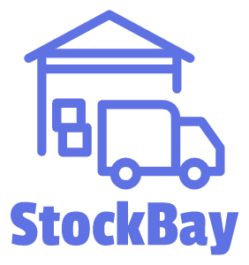
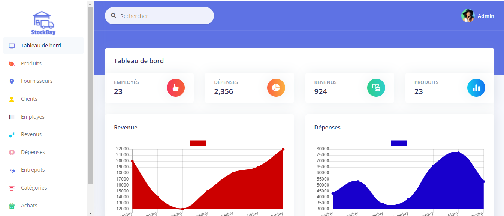

## Introduction

Stock Bay is an inventory management system that enables you to manage inventory, sales, purchases, customers, invoices, receiving payments, and more. Whether you run a small business or a large company It's the solution you need to manage inventory, purchases and sales - all in one app.

## Informations
-   Status: under development
-   Version: 1.0
-   Sector: industry
-   Created: November 2020
-   Last updated: December 2020

## Table of contents
* [Documentation](#general-info)
* [Demo](#demo)
* [Screenshots](#screenshots)
* [Technologies](#technologies)
* [Setup](#setup)
* [Features](#features)
* [Status](#status)
* [Contact](#contact)
* [License](#license)

## Documentation
https://github.com/aniskchaou/STOCKBAY-FRONTEND-ADMIN/wiki

## Demo
https://stock-bay.herokuapp.com/

## Screenshots

## Technologies
* Spring boot
* Angular

## Setup

## Features
 -  Manage products by categories
-   Manage purchases
-   Manage sales
-   Classify suppliers
-   Manage clients
-   Manage employees
-   Manage income
-   Manage expenses
-   Manage inventory

  

## Contact
contact@delta-dev-software.com

## License
<a href="license.txt">MIT License</a>